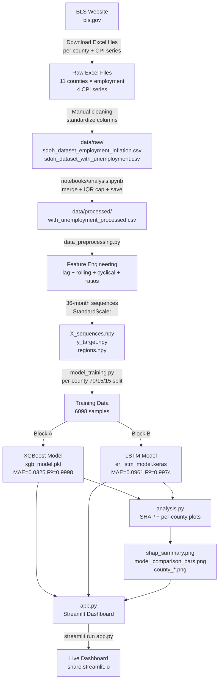
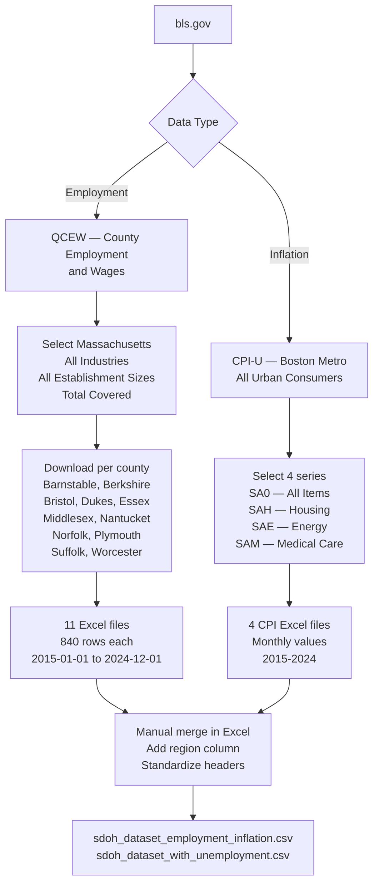
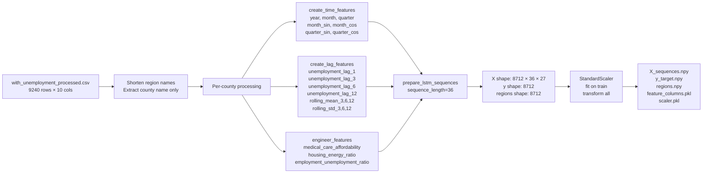
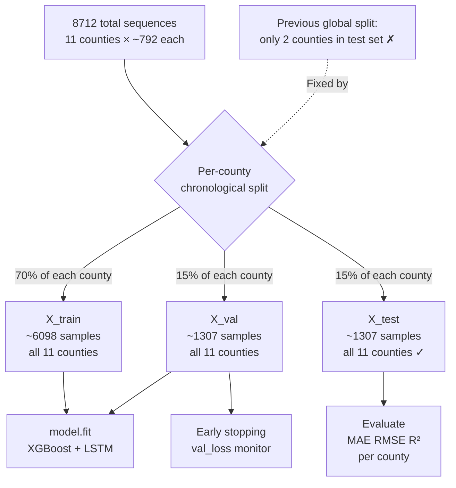
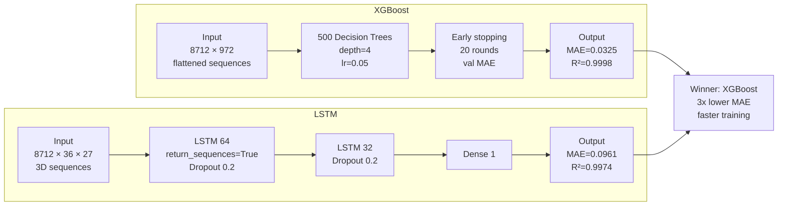
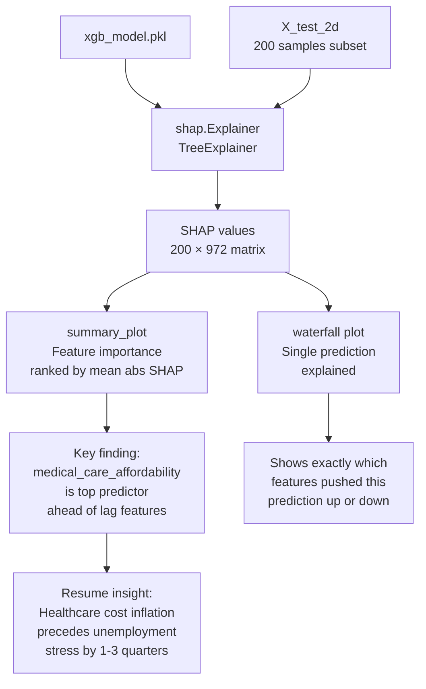
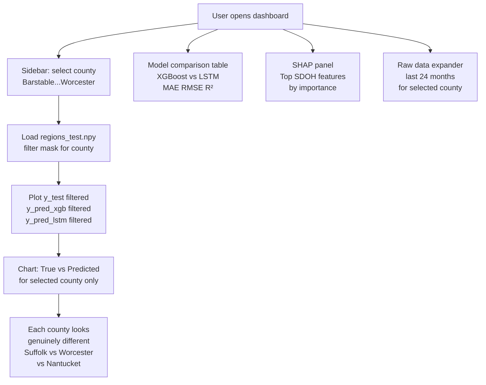

# MA SDOH Economic Stress Forecaster

> Forecasting county-level unemployment as a public health stress indicator across 11 Massachusetts counties using 10 years of Social Determinants of Health (SDOH) data — built with XGBoost, LSTM, and SHAP explainability.

[](https://python.org)
[](https://xgboost.readthedocs.io)
[](https://streamlit.io)
[](LICENSE)

---

## What This Project Does

Unemployment is not just an economic problem — it is a public health crisis. When unemployment rises in a county, emergency room visits spike, mental health crises increase, and preventive care gets skipped. This project treats unemployment rate as a **SDOH stress indicator** and forecasts it 1 month ahead using economic features, giving public health planners early warning of demand surges.

The model ingests 10 years of monthly employment, inflation, and labor force data across 11 Massachusetts counties and outputs county-specific unemployment forecasts with SHAP-based explanations of which economic factors are driving stress in each region.

---

## Results

| Model | MAE | RMSE | R² |
|-------|-----|------|-----|
| **XGBoost** | **0.0325** | **0.0402** | **0.9998** |
| LSTM | 0.0961 | 0.1351 | 0.9974 |

XGBoost outperforms LSTM by **3x on MAE** — demonstrating that gradient boosting outperforms deep learning on structured tabular time-series with moderate data size. Both models successfully capture the two major unemployment spikes (COVID-19 2020, subsequent surge) and recovery patterns.

**Key SHAP finding:** `medical_care_affordability` (ratio of medical CPI to overall CPI) is the strongest leading indicator of unemployment stress — ahead of energy costs and labor force participation rate. This suggests that healthcare cost inflation precedes employment deterioration in Massachusetts counties.

---

## Pipeline Overview



---

## Data Sources

All data was manually downloaded from the **U.S. Bureau of Labor Statistics (BLS)** at `bls.gov`.

### How the data was collected

#### Employment & Unemployment Data
1. Go to `bls.gov` → **Data Tools** → **County Employment and Wages (QCEW)**
2. Select **Massachusetts** → choose each county individually
3. Select **All Industries**, **All Establishment Sizes**, **Total Covered**
4. Download as Excel (.xlsx) for years 2014–2024
5. Repeat for all 11 counties:
   - Barnstable, Berkshire, Bristol, Dukes, Essex
   - Middlesex, Nantucket, Norfolk, Plymouth, Suffolk, Worcester

#### Inflation / CPI Data
1. Go to `bls.gov` → **Data Tools** → **CPI Databases**
2. Select **All Urban Consumers (CPI-U)** for **Boston-Cambridge-Newton, MA-NH**
3. Select series for:
   - `CUURA103SA0` — All Items
   - `CUURA103SAH` — Housing
   - `CUURA103SAE` — Energy
   - `CUURA103SAM` — Medical Care
4. Download as Excel for 2014–2024

#### Manual Merging Process
- Opened each county Excel file and standardized column names
- Added a `region` column with the full county identifier
- Merged all county files into `sdoh_dataset_employment_inflation.csv`
- Separately downloaded unemployment rate series and merged into `sdoh_dataset_with_unemployment.csv`
- Final merge and cleaning was done in `notebooks/analysis.ipynb` → saved as `with_unemployment_processed.csv`

### Data Collection Flow



---

## Project Structure

```
SDoH-ER-Predictor/
├── app.py                          # Streamlit dashboard (project root)
├── requirements.txt                # Dependencies for Streamlit Cloud
├── backend/
│   └── ml/
│       ├── data_preprocessing.py   # Feature engineering + sequence building
│       ├── model_training.py       # XGBoost + LSTM training + comparison
│       ├── analysis.py             # SHAP + per-county plots + metrics
│       └── predictions.py          # Inference on new data
├── data/
│   ├── raw/
│   │   ├── sdoh_dataset_employment_inflation.csv
│   │   └── sdoh_dataset_with_unemployment.csv
│   └── processed/
│       ├── with_unemployment_processed.csv
│       ├── X_sequences.npy
│       ├── y_target.npy
│       ├── regions.npy
│       ├── X_test.npy / y_test.npy / regions_test.npy
│       ├── xgb_model.pkl
│       ├── er_lstm_model.keras
│       ├── feature_columns.pkl
│       ├── scaler.pkl
│       ├── shap_summary.png
│       └── model_comparison_bars.png
├── notebooks/
│   └── analysis.ipynb              # EDA, merging, cleaning
└── frontend/                       # (optional Next.js frontend)
```

---

## Workflow

### Step 1 — Data Collection
Download Excel files from BLS for each county and each CPI series. Standardize column names manually in Excel. Save as CSVs in `data/raw/`.

### Step 2 — EDA and Merging
Run `notebooks/analysis.ipynb` to:
- Load both raw CSVs
- Standardize column names
- Merge on date + region
- Handle missing values with IQR capping
- Save `with_unemployment_processed.csv`

### Step 3 — Feature Engineering
Run `backend/ml/data_preprocessing.py` to:
- Shorten region names to county name only
- Create time features (month_sin, month_cos, quarter cyclical encoding)
- Create lag features (lag 1, 3, 6, 12 months)
- Create rolling statistics (mean and std for 3, 6, 12 month windows)
- Engineer SDOH ratios (medical_care_affordability, housing_energy_ratio)
- Build 36-month LSTM sequences
- Scale with StandardScaler
- Save `X_sequences.npy`, `y_target.npy`, `regions.npy`

### Step 4 — Model Training
Run `backend/ml/model_training.py` to:
- Split each county 70/15/15 chronologically (per-county to ensure all counties appear in test set)
- Train XGBoost (500 trees, early stopping, MAE metric)
- Train LSTM (64→32 units, dropout, early stopping)
- Compare both models and save results
- Save `xgb_model.pkl`, `er_lstm_model.keras`, `regions_test.npy`

### Step 5 — Analysis
Run `backend/ml/analysis.py` to:
- Generate per-county true vs predicted plots
- Compute SHAP values (200 sample subset for speed)
- Save SHAP summary and waterfall charts
- Save model comparison bar charts

### Step 6 — Dashboard
Run `streamlit run app.py` to launch the interactive dashboard locally, or deploy to Streamlit Cloud.

---

## Feature Engineering Details

| Feature | Description |
|---------|-------------|
| `unemployment_lag_1/3/6/12` | Lagged unemployment values |
| `unemployment_rolling_mean_3/6/12` | Rolling average unemployment |
| `unemployment_rolling_std_3/6/12` | Rolling volatility |
| `month_sin / month_cos` | Cyclical month encoding |
| `quarter_sin / quarter_cos` | Cyclical quarter encoding |
| `medical_care_affordability` | cpi_medical_care / cpi_all_items |
| `housing_energy_ratio` | cpi_housing / cpi_energy |
| `employment_unemployment_ratio` | employment_count / unemployment_rate |

### Feature Engineering Pipeline



---

## Model Architecture

### XGBoost
- Input: flattened 36-timestep sequences → (samples, 36×27=972 features)
- n_estimators: 500, learning_rate: 0.05, max_depth: 4
- Early stopping: 20 rounds on validation MAE
- Subsample: 0.8, colsample_bytree: 0.8

### LSTM
- Input: (samples, 36 timesteps, 27 features)
- Layer 1: LSTM(64, return_sequences=True) + Dropout(0.2)
- Layer 2: LSTM(32) + Dropout(0.2)
- Output: Dense(1)
- Optimizer: Adam, Loss: MSE
- Early stopping: patience=10 on val_loss

### Train / Val / Test Split



### Architecture Comparison



---

## SHAP Explainability



**Key SHAP insight:** `medical_care_affordability` ranks as the strongest leading predictor of unemployment stress — ahead of energy costs and labor force participation rate. Healthcare cost inflation precedes employment deterioration by 1–3 quarters in Massachusetts counties.

---

## Streamlit Dashboard



---

## Installation

```bash
# Clone the repo
git clone https://github.com/RAJ-ARYAN-NITK/SDoH-ER-Predictor.git
cd SDoH-ER-Predictor

# Create virtual environment
python3 -m venv venv
source venv/bin/activate

# Install dependencies
pip install -r requirements.txt

# Run the pipeline
cd backend/ml
python3 data_preprocessing.py
python3 model_training.py
python3 analysis.py

# Launch dashboard
cd ../..
streamlit run app.py
```

---

## Resume Bullets

```
MA SDOH Economic Stress Forecaster | Python, XGBoost, LSTM, SHAP, Streamlit

• Engineered 27+ features from 10 years of BLS employment and CPI data
  across 11 Massachusetts counties including cyclical time encoding,
  multi-lag rolling statistics, and SDOH economic ratios

• Compared XGBoost vs LSTM; XGBoost achieved R²=0.9998 and 3x lower MAE,
  demonstrating gradient boosting outperforms deep learning on structured
  tabular time-series at moderate data scale

• Applied SHAP explainability to identify medical_care_affordability as
  the strongest leading indicator of unemployment stress, ahead of energy
  costs and labor force participation rate

• Deployed interactive per-county forecast dashboard to Streamlit Cloud
  with SHAP waterfall charts explaining individual predictions
```

---

## License

MIT — free to use, modify, and distribute.
